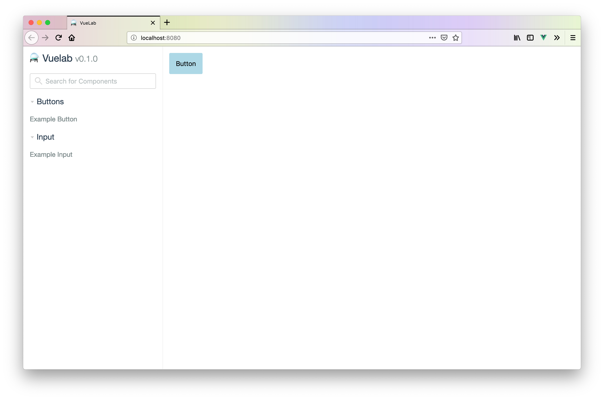

# ⚗️ Vuelab

Component Driven Development (CDD) for Vue.js!



## Installation

It is recommended that Vuelab live in your project as a development dependency.

```
npm install --dev vuelab
```

This way your team or contributors can easily get started with visual development and documentation. Everyone gets to be on the same page!

Once Vuelab is installed, be sure to add these scripts to your `package.json`:

```json
{`
  "scripts": {
    "vuelab:start": "vuelab path/to/components --open",
    "vuelab:build": "vuelab build path/to/components --dist path/to/build"
  }
}
```

We will cover what these do in the next section.

## Usage

Working with Lab is incredibly simple.

```
npm run vuelab:start
```

With this command, your browser will launch in [localhost:8080](localhost:8080) (or the next available port) where you will have an environment to view your "Experiments."

The CLI will sniff through the `components/` directory of your Vue.js project for `*.experiment.vue` files.

```
components/
  MyButton.vue
  MyButton.experiment.vue
```

## Experiments

What does an "Experiment" look like? Why, just like any other [Single File Component](https://vuejs.org/v2/guide/single-file-components.html)!

For example, `MyButton.experiment.vue` will look like this:

```html
<template>
  <my-button :theme="theme">My Label</my-button>
</template>

<script>
  import MyButton from "./MyButton";

  export default {
    components: {
      MyButton
    },
    data() {
      return {
        theme: "primary"
      };
    }
  };
</script>

<style scoped>
  /* ... */
</style>
```

Ther are no new fancy apis to learn. Everything you knew about Vue.js applies here.

## Configuration

Sometimes, you will be using a 3rd party component library, like [Buefy](https://buefy.org/). You will need to inject this into Vuelab.

First, create a `.vuelab` directory at the root of your project. Then create a `bootstrap.js` file with the following content:

```js
// JS
import Buefy from "buefy";

// CSS
import "buefy/dist/buefy.css";

export default function(Vuelab) {
  Vuelab.use(Buefy);
}
```

As you can see, this works similarly to a standard Plugin registration for Vue.js. This is because `Vuelab` is actually a regular `Vue` vm instance!

Vuelab looks for `.vuelab/bootstrap.js` to handle your environment configuration.

## Deployment

When you're ready to share your components with the rest of the team, just build a static version of the Lab with our earlier script.

```
npm run vuelab:build
```

This will create `lab/` directory with the statically compilled app.

It is highly recommended that you leave this command as part of some build process when deploying. Given this, you will definitely want to make sure the Lab build artifacts are ignored in `.gitignore`.

```
lab/
```

## FAQ

### _What is "Component Driven Development?"_

Think of CDD as the visual equivalent to Test Driven Development.

This is a method of front-end development where developers focus on designing and building components in an isolated environment. This ensures that components are truly reusable, as you will easily decouple from full pages and api calls. Additionally, this is a great way to keep a living documentation for your product's components.

### _How does this help my team?_

Developing components in a full-application context is very difficult. You may have to deal with the usual pains of logging in, making sure apis are implemented/mocked, state is maintained, etc. With Vuelab, you can develop components without side effects and keep living documentation for free!

### _Why not use Storybook?_

[Storybook](https://storybook.js.org/) is great! If you are already using it, keep on doing so. That is, unless you really want take time from development for a big overhall.

That said, if you're new to CDD or looking for a solution for your Vue.js project, this is the tool for you! Vuelab is built specficially for Vue.js projects, taking advantage of existing apis rather creating new ones to accomodate multiple frameworks (such is the case with Storybook).

## CLI

`serve path/to/components` spins up the Lab environment.

`build path/to/components` generates a static build of the Lab under the `lab/` directory.
